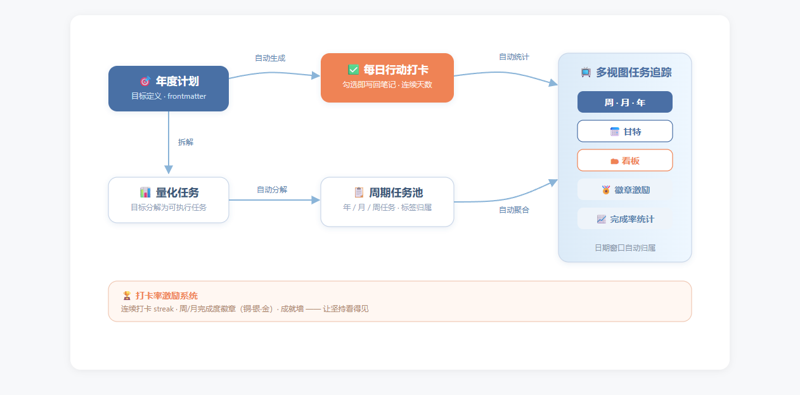
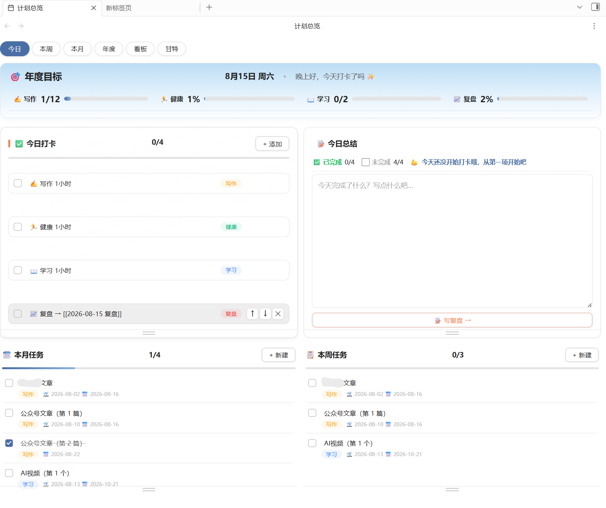

# PlanFlow
PlanFlow 是一个基于 Obsidian 的计划系统插件：

- **计划自动拆解+每日打卡行动：让目标细化成可执行的颗粒**
- **清晰目标追踪：六视图一体自由切换，今日打卡 / 周 / 月 / 年度 / 看板 / 甘特**
- **自动统计激励系统：打卡连续天数 + 铜银金徽章 + 成就墙**
- **数据自动流转：统一数据源，纯 Markdown，告别杂乱**

📖 **完整图文使用说明（设计理念 / 功能性 / 易用性）：[docs/USAGE.md](docs/USAGE.md)**

## 一、设计理念

### 1. 计划是一条流，不是一堆表

大多数计划工具把「年度目标、月度计划、每日打卡」做成互不相通的三套数据，靠手动同步。PlanFlow 则实现计划自动拆解、数据统一互通，让计划和执行都更简单：



- **数据只产生一次**：年度计划定义在 `年度计划.md` 的 frontmatter，任务写在任务池，打卡勾选写回每日笔记——**没有重复录入**。
- **全视图聚合追踪**：本周/本月/年度进度、看板、甘特、统计徽章，全部由日期窗口自动聚合，**零配置**。
- **日期窗口自动归属**：任务标上起止日期，本周 = ISO 周、本月 = 自然月、当年 = 当前年份——不需要手动建立任何父子关系，也不会断链。

### 2. 执行优先

「今日打卡 + 今日总结」是界面的视觉中心，年度目标进度条常驻顶部——打开 Obsidian 第一眼看到的是「今天要做什么、做了多少」。

 

## ✨ 功能
| 视图 | 职责 | 核心操作 |
|---|---|---|
| **年度** | 计划总览与目标管理 | 新建计划自动生成每日行动打卡，新建量化目标任务，自动拆解到月和周 |
| **今日** | 目标 → 执行 → 总结 | 勾选打卡、写今日总结、一键写复盘 |
| **本周 / 本月** | 周期任务预览与进度追踪 | 可以新建临时任务、查看完成率 |
| **看板** | 按计划分组的执行面板 | 列头拖拽调宽、按计划过滤 |
| **甘特** | 时间轴排期 | 拖拽调期、查看重叠 |

其他特性：
- 🏆 打卡连续天数（streak）+ 周/月完成度徽章（铜/银/金）
- 📊 按计划的完成率统计、年度目标自动进度
- 🎨 深空蓝主题色 + 珊瑚橙行动区 + 计划色点缀（明暗主题适配）
- 📝 每日笔记自动生成（代码内模板），总结可自动派生

## v1.2.0 新功能

- 设置页视觉化图标选择器（18 个 Lucide 格子点选 + 自定义输入兜底）
- 复盘模板文件化：`raw/计划/复盘模板.md`（Obsidian 内直接编辑，`{date}` 自动替换；用户 A 股模板已自动迁移）
- 设置页名称残留清零（PlanBoard → PlanFlow 全部）
- 插件图标用原生 `home`（自定义多色 SVG 在 18px 下不可行，已放弃；追踪素材留 `test/planflow-icon-*.svg`）

## 🚀 安装

### 方式一：BRAT（推荐，支持自动更新）

1. 安装 [BRAT](obsidian://show-plugin?id=obsidian42-brat) 插件
2. BRAT 设置 → Add Beta plugin → 输入 `yezhangdeng01/PlanFlow`
3. 启用 PlanFlow（后续发新版自动更新）

### 方式二：手动安装

1. 下载 [最新 Release](https://github.com/yezhangdeng01/PlanFlow/releases) 的 `main.js`、`manifest.json`、`styles.css`
2. 在 vault 中创建 `.obsidian/plugins/planflow/` 目录，放入三个文件
3. Obsidian 设置 → 第三方插件 → 启用 PlanFlow

## 💰 赞助

如果你喜欢 PlanFlow，可以通过以下方式支持项目的发展：

- [Buy Me a Coffee](https://www.buymeacoffee.com/yezhangdeng01)
- [爱发电](https://afdian.net/@yezhangdeng01)

 FUNDING.yml 模板已在仓库中提供，可直接使用。

## 📂 数据格式（vault 内纯 Markdown）

```
raw/计划/                  ← 可在设置中修改根路径
├── 2026/
│   ├── 年度计划.md         ← 计划定义（frontmatter: plans）
│   ├── 任务.md             ← 任务池（所有计划的任务）
│   ├── 成就.md             ← 徽章记录
│   ├── 每日/2026-08-15.md  ← 每日打卡笔记（自动生成）
│   └── 周/2026-W33.md      ← 周目标（自动聚合）
```

**年度计划 frontmatter 示例**：

```yaml
---
plans:
  - name: 阅读
    type: 量化
    target: 24
    unit: 本
    desc: 读书笔记
  - name: 健身
    type: 习惯
    target: 100
    unit: 天
---
```

任务通过 `#计划/写作` 标签或 frontmatter 归属计划，日期窗口（本周=ISO 周、本月=自然月）自动聚合到对应视图。

## 🛠 开发

```bash
npm install
npm run build    # tsc + esbuild → main.js
npm run typecheck
```

## ⚠️ 说明

- UI 目前为中文（数据格式与字段名保持英文，便于国际化）
- 纯本地运行：无网络调用、无遥测、无数据外发

## 📄 许可

MIT © 2026 JCH
