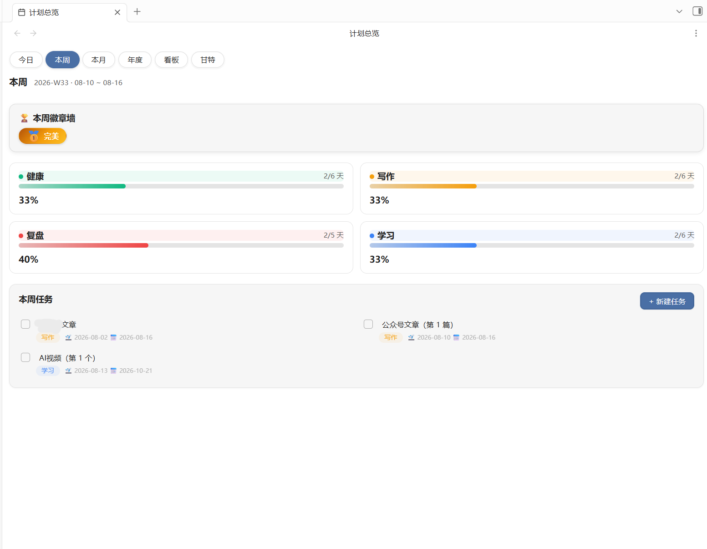
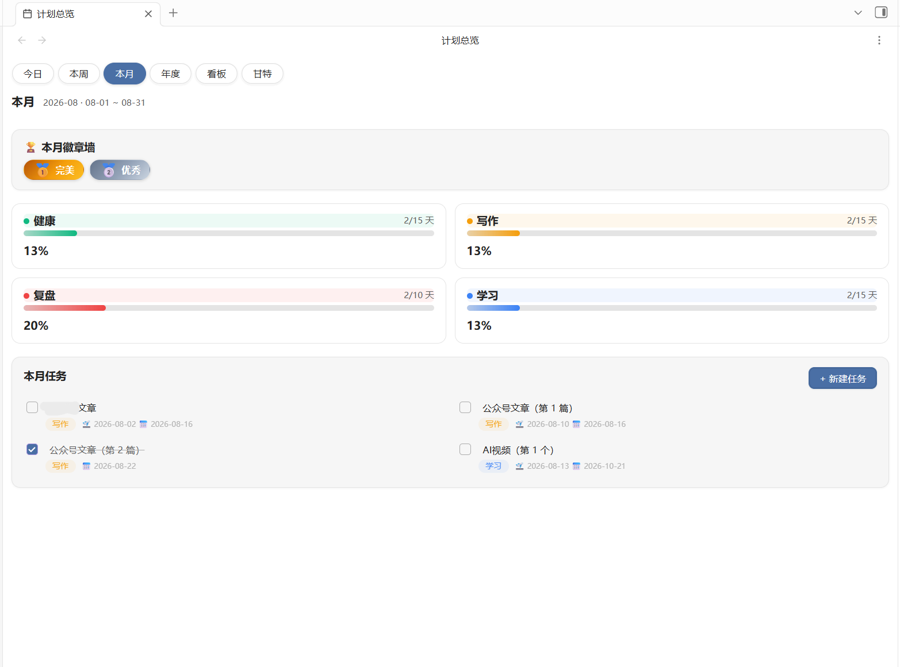
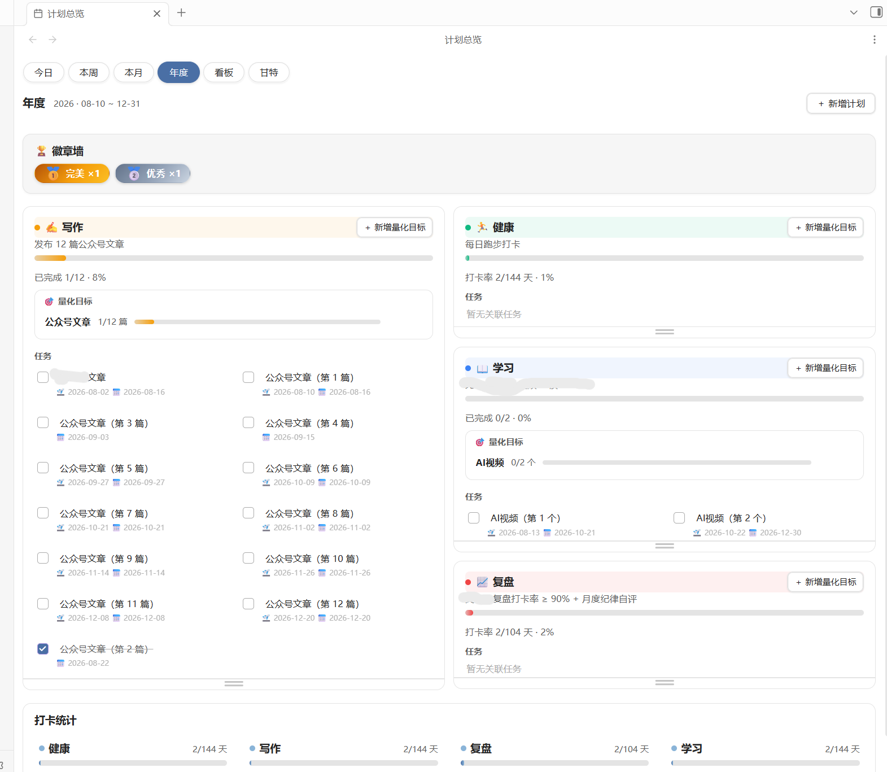
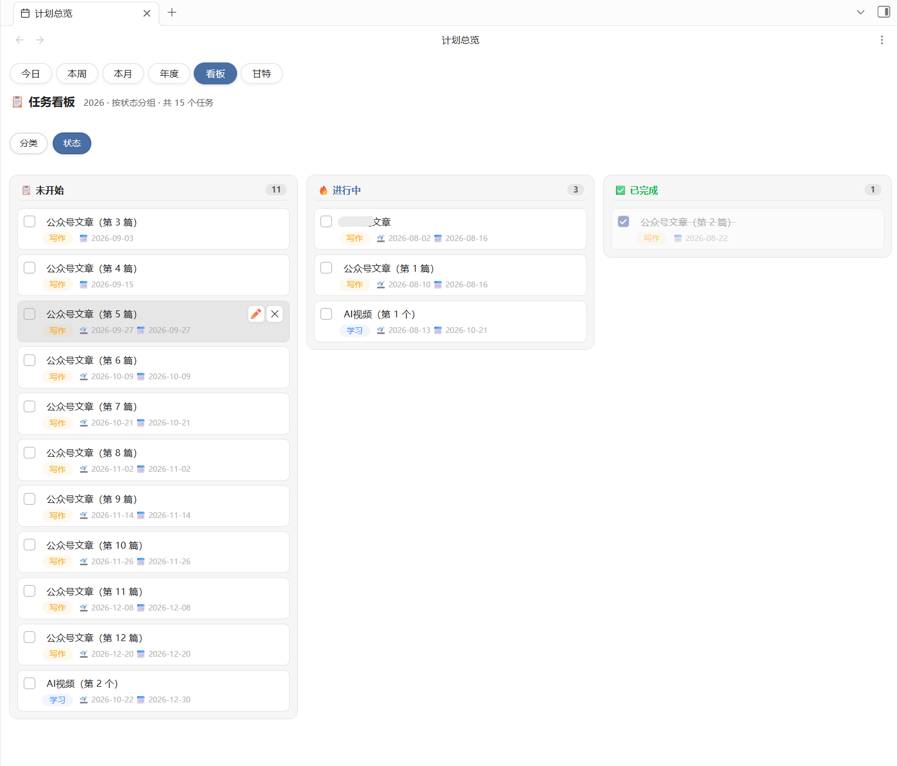
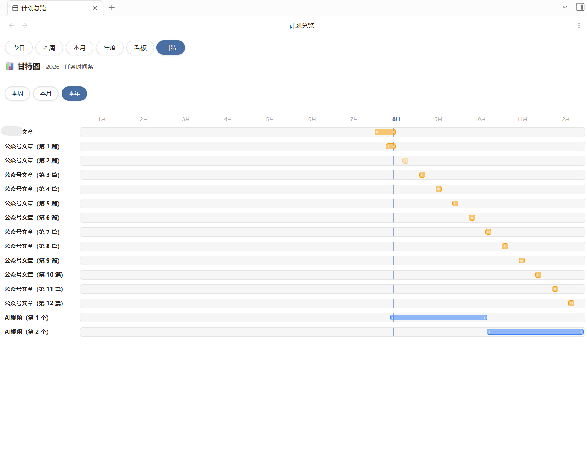

# PlanFlow 使用说明

> PlanFlow 是一个基于 Obsidian 的计划系统插件：

- **计划自动拆解+每日打卡行动：让目标细化成可执行的颗粒**
- **清晰目标追踪：六视图一体自由切换，今日打卡 / 周 / 月 / 年度 / 看板 / 甘特**
- **自动统计激励系统：打卡连续天数 + 铜银金徽章 + 成就墙**
- **数据自动流转：统一数据源，纯 Markdown，告别杂乱**

---

## 一、设计理念

### 1. 计划是一条流，不是一堆表

大多数计划工具把「年度目标、月度计划、每日打卡」做成互不相通的三套数据，靠手动同步。PlanFlow 则实现计划自动拆解、数据统一互通，让计划和执行都更简单：

- **数据只产生一次**：年度计划定义在 `年度计划.md` 的 frontmatter，任务写在任务池，打卡勾选写回每日笔记——**没有重复录入**。
- **全视图聚合追踪**：本周/本月/年度进度、看板、甘特、统计徽章，全部由日期窗口自动聚合，**零配置**。
- **日期窗口自动归属**：任务标上起止日期，本周 = ISO 周、本月 = 自然月、当年 = 当前年份——不需要手动建立任何父子关系，也不会断链。

### 2. 执行优先

「今日打卡 + 今日总结」是界面的视觉中心，年度目标进度条常驻顶部——打开 Obsidian 第一眼看到的是「今天要做什么、做了多少」。

### 3. 数据属于你

所有数据是普通 Markdown 文件（frontmatter + 任务列表 + 标签），随时可读、可迁移、可备份，插件停用数据完好。

---

## 二、功能性

### 六个视图，一条闭环

| 视图 | 职责 | 核心操作 |
|---|---|---|
| **年度** | 计划总览与目标管理 | 新建计划自动生成每日行动打卡，新建量化目标任务，自动拆解到月和周 |
| **今日** | 目标 → 执行 → 总结 | 勾选打卡、写今日总结、一键写复盘 |
| **本周 / 本月** | 周期任务预览与进度追踪 | 可以新建临时任务、查看完成率 |
| **看板** | 按计划分组的执行面板 | 列头拖拽调宽、按计划过滤 |
| **甘特** | 时间轴排期 | 拖拽调期、查看重叠 |

### 今日视图

- **年度目标条**：四个目标（写作/健康/学习/复盘）进度一目了然，进度条随打卡自动前进
- **今日打卡**：勾选即写回笔记；连续打卡天数（streak）与分档徽章（铜/银/金）即时显示
- **今日总结**：自动派生（完成/未完成统计）+ 手动撰写双通道，互不覆盖
- **写复盘**：一键生成当日复盘笔记

### 周 / 月视图

 

按日期窗口自动聚合任务，进度条 + 完成率统计。月/周卡可拖底部调节高度（联动等高）。

### 年度视图

- **卡片排序**：拖卡头即可——对准另一张卡 = 真交换，拖到间隙 = 精确插入，跨列拖动 = 移到目标列（JS 显式两列容器，插哪是哪）
- **卡片高度**：拖卡下边缘自由调节，每卡独立记忆
- **量化目标**：卡头「＋ 新增量化目标」，进度自动统计
- **右键菜单**：卡头右键 → 编辑计划 / 删除计划

### 看板 / 甘特

 

看板可按计划和状态切换分列视图；甘特时间轴可拖拽调期。

### 统计与激励

自动统计打卡和任务完成率，分铜金银三个徽章自动提示鼓励
- 完成率统计（按计划/周期）
- 连续打卡 streak、周/月完成度徽章（铜银金）
- 成就墙记录里程碑

---

## 三、易用性

### 快速上手（3 步）

1. **建年度计划**：在年度页面新建年度计划，会自动创建相关每日行动打卡：

2. **建任务**：在相应年度计划下创建量化目标，会自动拆解成周期任务；

3. **打卡**：今日视图勾选即完成，进度自动聚合到周/月/年。

### 常用交互速查

| 想做什么 | 怎么做 |
|---|---|
| 新建任务 | 各视图「＋ 新建」按钮 |
| 调整计划顺序 | 年度视图拖卡头 |
| 调整卡片高度 | 拖卡下边缘把手 |
| 编辑/删除计划 | 年度卡头**右键** |
| 添加量化目标 | 年度卡头「＋ 新增量化目标」 |
| 写复盘 | 今日总结卡「写复盘 →」 |
| 自定义打卡项 | 设置页配置每日打卡模板 |

### 说明

- 界面为中文；数据字段（frontmatter/标签）保持英文
- 纯本地运行：无网络调用、无遥测、数据不出 vault
